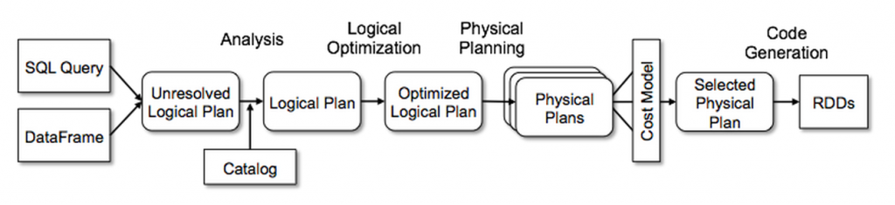

# Catalyst Optimizer



The Catalyst optimizer is the integrated tool in Apache Spark that optimizes SQL queries or DataFrame operations, significantly improving performance, cost savings, and resource management of the distributed system.
It consists of four main phases: Analysis, Logical Planning, Physical Planning, and Code Generation.

## Execution Plan
An execution plan is a **structured set of operations executed to translate a query language statement into a set of optimized logical and physical operations**.
Specifically for Apache Spark, it represents the set of operations that will be executed from the SQL statement or DataFrame operations, thus the DAG (Directed Acyclic Graph) that will be sent to Spark executors for distributed processing.
You can think of it as a detailed roadmap that guides you through the inner workings of a Spark job, showing exactly how the data will be processed.

The two main components are:
- **logical plan**: represents at a high level the transformations and operations specified in the Spark application; it's an abstract and implementation-independent description of what you want to do with your data, without worrying about how it will actually be executed;
- **physical plan**: provides concrete details of how Spark translates your application into a set of executable actions; it also reveals how Spark tries to optimize your job for performance, including specific execution strategies, memory management, and join strategies.

The optimizer that Spark uses is Catalyst. During its work, it produces different types of plans (as shown in the figure above). The figure illustrates the entire flow of the Catalyst optimization process, from input sources (SQL Query or DataFrame) to the final generation of executable RDDs (Resilient Distributed Datasets).

As you can see in the image, the flow consists of:
1. **Analysis**: transforms the input (SQL or DataFrame) into an Unresolved Logical Plan, which is then resolved using information from the Catalog
2. **Logical Optimization**: optimizes the logical plan without changing its semantics
3. **Physical Planning**: generates multiple alternative physical plans
4. **Cost Model**: evaluates physical plans based on cost metrics
5. **Selected Physical Plan**: chooses the optimal physical plan
6. **Code Generation**: generates optimized code that will be executed as RDDs

The goal of all these operations and plan generations is to automatically produce the most effective way to process your query, building an optimal physical plan to be sent to the executors.

After that, and only after that, the physical plan is executed through one or more stages and tasks in a lazy manner - this means that no processing is started until an actual result is requested (for example with actions like collect(), show(), save(), etc.).

#### explain()
To get the plans during execution, you can use Spark's *explain()* API, which by default returns the physical plan.
Before Spark 3.0, it had only two available modes:
- explain(extended=False) to display only the physical plan
- explain(extended=True) to display all plans (parsed, analyzed, optimized and physical)

Starting from Spark 3.0, the syntax changed to explain(mode=\<chosen_mode\>), where the available modes are:
- *simple*: shows only the physical plan (equivalent to the default behavior)
- *extended*: displays all plans (parsed logical plan, analyzed logical plan, optimized logical plan and physical plan)
- *codegen*: displays the Java code actually generated and planned to be executed (useful for advanced debugging)
- *cost*: prints the optimized logical plan along with its cost statistics, allowing you to evaluate expected performance
- *formatted*: displays a more readable formatted physical plan and a section with details of each node in the execution tree

## Phases and their plans

### First step: Parsed Logical plan generation
Once the query needs to be executed, the first step is to parse the SQL or DataFrame operations provided by the user. At this point, if SQL is provided, Spark checks that everything is syntactically correct (verifies the SQL syntax, but not yet the validity of table and column names). Then, a first version of a logical plan is produced where relation and column names are not yet resolved (hence the term "unresolved").

The parsed logical plan outlines the logical structure of the query, including joins, aggregations, and defining aliases. Complex projections are not yet processed at this stage. It is essentially a tree of operations that represents the structure of the query as written by the user.

```
== Parsed Logical Plan ==
'Aggregate ['name, 'price], [unresolvedalias('name, None), unresolvedalias('price, None), sum('count) AS c#2709]
+- Filter (id#2661 = 2)
   +- Join Inner, (id#2661 = itemid#2668)
      :- LogicalRDD [id#2661, name#2662, price#2663], false
      +- LogicalRDD [id#2667, itemid#2668, count#2669], false
```

### Analyzed logical plan
In this phase, Spark performs semantic analysis and a complete resolution of dependencies. It will resolve everything that is not yet resolved by accessing an internal Spark structure called Catalog (the metastore), which contains information about all registered tables, views, and functions.

Through semantic analysis, it verifies:
- the existence of all referenced tables and views
- the validity of all column names
- data type compatibility
- the validity of operations with respect to data types
- the correct structure of schemas
- the resolution of all expressions and aliases

It also ensures that everything is semantically correct and that the requested operations are possible. If everything is correct, a complete logical plan is produced. The output is a logical plan that incorporates metadata and information about tables, columns, and projections, with all references fully resolved.

```
== Analyzed Logical Plan ==
name: string, price: float, c: bigint
Aggregate [name#2662, price#2663], [name#2662, price#2663, sum(cast(count#2669 as bigint)) AS c#2709L]
+- Filter (id#2661 = 2)
   +- Join Inner, (id#2661 = itemid#2668)
      :- LogicalRDD [id#2661, name#2662, price#2663], false
      +- LogicalRDD [id#2667, itemid#2668, count#2669], false
```

### Optimized logical plan
Once the complete logical plan is ready, it will be optimized by applying various advanced techniques such as:

- **Predicate pushdown**: pushes filters as close as possible to the data source to reduce the amount of data to be processed in later stages
- **Constant folding**: evaluates constant expressions in advance
- **Column pruning**: eliminates unnecessary columns as early as possible
- **Partition pruning**: avoids reading unnecessary partitions
- **Join reordering**: reorders joins to minimize the size of intermediate datasets
- **Rule-based transformations**: applies a set of predefined optimization rules

During optimizations, logical operations are reordered to optimize the logical plan, filters are pushed down to the LogicalRDD to reduce the volume of data processed, and unnecessary subqueries and projections are removed.

The output is an optimized logical plan that represents a significantly more efficient version of the query in terms of data retrieval and processing, while maintaining the same semantics and results as the original query.

```
== Optimized Logical Plan ==
Aggregate [name#2746, price#2747], [name#2746, price#2747, sum(cast(count#2753 as bigint)) AS c#2763L]
+- Project [name#2746, price#2747, count#2753]
   +- Join Inner, (id#2745 = itemid#2752)
      :- Filter (isnotnull(id#2745) AND (id#2745 = 2))
      :  +- LogicalRDD [id#2745, name#2746, price#2747], false
      +- Project [itemid#2752, count#2753]
         +- Filter ((itemid#2752 = 2) AND isnotnull(itemid#2752))
            +- LogicalRDD [id#2751, itemid#2752, count#2753], false
```

### Physical plan
From the optimized logical plan, the physical plan is generated, also known as the execution plan. Unlike the logical plan which describes "what to do", the physical plan specifies exactly "how to do it" in Spark's distributed context. It describes in detail how operations will be physically executed on the cluster, including information about:

- how data will be split and distributed
- which specific algorithms will be used for joins, aggregations, and sorting
- how communication will occur between cluster nodes
- which execution-level optimizations will be applied

To select the best physical plan, the Catalyst optimizer actually generates many alternative plans using different strategies, considering:
- data partitioning
- necessary shuffling operations
- task distribution across nodes
- available resources (memory, CPU)
- optimal level of parallelism
- data locality
- available statistics on the data

Each candidate physical plan is estimated based on projected execution time and resource consumption. Then, using a sophisticated cost model, only one physical plan will be selected to be executed - the one that the Spark engine deems most efficient.

The final output is a detailed physical plan involving:
- specific aggregation operations (e.g., HashAggregate)
- optimized projections
- specific join strategies (e.g., SortMergeJoin, BroadcastHashJoin)
- data scanning methods
- optimizations like broadcast joins and hashing
- data exchange operations (Exchange) between executors

After that, and only after that, the physical plan is executed through one or more stages and tasks in a lazy manner, activated only when a concrete result is requested.

```
== Physical Plan ==

*(4) HashAggregate(keys=[name#10, price#11], functions=[finalmerge_sum(merge sum#72L) AS sum(cast(count#17 
as bigint))#50L], output=[name#10, price#11, c#51L])

+- Exchange hashpartitioning(name#10, price#11, 200), true, [id=#299]

   +- *(3) HashAggregate(keys=[name#10, knownfloatingpointnormalized(normalizenanandzero(price#11)) AS price#11], 
      functions=[partial_sum(cast(count#17 as bigint)) AS sum#72L], output=[name#10, price#11, sum#72L])
      
      +- *(3) Project [name#10, price#11, count#17]
         +- *(3) SortMergeJoin [id#9], [itemid#16], Inner
            :- Sort [id#9 ASC NULLS FIRST], false, 0
            :  +- Exchange hashpartitioning(id#9, 200), true, [id=#288]
            :     +- *(1) Filter (isnotnull(id#9) AND (id#9 = 2))
            :        +- *(1) Scan ExistingRDD[id#9,name#10,price#11]
            +- Sort [itemid#16 ASC NULLS FIRST], false, 0
               +- Exchange hashpartitioning(itemid#16, 200), true, [id=#292]
                  +- *(2) Project [itemid#16, count#17]
                     +- *(2) Filter ((itemid#16 = 2) AND isnotnull(itemid#16))
                        +- *(2) Scan ExistingRDD[id#15, itemid#16, count#17]

```

### Code Generation (Code Generation)
After determining the optimal physical plan, Spark performs a final optimization phase through the generation of optimized Java code (using the Janino library). This phase, known as "Whole-Stage Code Generation", converts entire parts of the physical plan into Java code compiled at runtime, which can be executed much faster than interpreting individual operations.

This final phase eliminates many execution overheads by combating issues such as:
- Virtual function calls
- Interpretation of data structures
- Boxing/unboxing of primitive types
- Unnecessary memory allocations

## Physical plan generation with native RDDs

When working directly with RDDs (Resilient Distributed Datasets) instead of using DataFrame or SQL, the optimization process is substantially different. RDDs represent Spark's low-level API, and when you use them directly, you completely bypass the Catalyst optimizer.

### Fundamental differences in execution with RDDs

1. **Absence of the Catalyst optimizer**: When you use RDDs, the transformations you define are applied exactly as you wrote them. There is no optimizer that automatically reorganizes, combines, or optimizes operations.

2. **Direct control over the execution plan**: With RDDs, you as a programmer explicitly define the execution plan through the transformations you apply. This offers more granular control but requires greater expertise to achieve optimal performance.

3. **Direct execution**: The DAG (Directed Acyclic Graph) of operations is built directly from the RDD transformations you've defined, without going through logical plans and optimization phases.

### How the execution plan generation works with RDDs

1. **DAG Creation**: For each RDD action (like collect(), count(), save()), Spark creates a DAG that represents all the transformations needed to produce the result.

2. **DAGScheduler**: The DAGScheduler component divides the graph into stages based on shuffle boundaries (points where data must be redistributed among cluster nodes).

3. **Stage**: Each stage contains a sequence of transformations that can be executed without shuffling. Stages are separated by operations that require data shuffling (like groupByKey, reduceByKey, join, etc.).

4. **Task**: Each stage is then divided into individual tasks that operate on specific partitions of the data. These tasks represent the smallest unit of work in Spark.

5. **Scheduling**: The scheduler assigns tasks to available workers in the cluster, trying to maintain data locality to reduce network transfer.

### Manual optimizations with RDDs

Without Catalyst, you are responsible for manually applying many optimizations:

- **Persistence**: You must explicitly decide which RDDs to cache with .cache() or .persist()
- **Partitioning**: You must manually manage the number of partitions and partitioning strategy
- **Avoiding shuffling**: You must reorganize operations to minimize costly shuffles
- **Serialization**: You must choose appropriate serialization formats
- **Load balancing**: You must ensure that work is evenly distributed

### Advantages and disadvantages compared to the Catalyst approach

**Advantages of RDDs**:
- More granular control over execution
- Ability to implement complex custom algorithms
- Support for unstructured data types
- No overhead for plan generation and optimization

**Disadvantages**:
- Lack of automatic optimizations
- Need for greater expertise to achieve good performance
- More verbose and harder to maintain code
- Absence of schema-based optimizations like column pruning

### Visualizing the plan with RDDs

Even with RDDs, it's possible to visualize a representation of the execution plan, although less structured than that offered by Catalyst:

```scala
// Example in Scala
val rdd = sc.parallelize(1 to 1000).map(_ * 2).filter(_ > 500)
// View the DAG for this RDD
println(rdd.toDebugString)
```

This will show the lineage of the RDD, which provides information about dependencies and applied transformations, but without the optimizations and details that would be visible in a physical plan generated by Catalyst.

## Benefits of understanding the execution plan
- **Query optimization**: by examining the physical plan, developers can gain deep insight into how a query is executed, obtaining crucial information about how it is processed using available resources, partitioning strategies, and join methods. This allows for more efficient query rewriting.

- **Performance tuning**: developers can identify potential performance bottlenecks from the execution plan, such as:
  - Unnecessary or excessive shuffling operations
  - Inefficient joins (for example, when a broadcast join would be more appropriate)
  - Filters applied too late in the execution flow
  - Suboptimal data redistribution
  - Suboptimal use of partitions
  
  This analysis opens the possibility to revise the query, adjust specific Spark configurations (such as spark.sql.shuffle.partitions), or choose the most appropriate join strategy, like deciding which datasets/tables to broadcast.

- **Debugging**: when queries don't produce the expected result or have significantly lower performance than expected, the physical plan can provide valuable clues about the problem, pinpointing the problematic stage or transformation in the plan. This is particularly useful for diagnosing:
  - Data type issues or conversions
  - Errors in join conditions
  - Problems with aggregation functions
  - Inappropriate choice of execution strategies

- **Cost prediction**: by analyzing the physical plan, it's possible to better estimate the computational cost of a query in terms of memory usage, shuffle operations, and execution time, allowing for better planning of cluster resources.

- **Education and training**: understanding execution plans is a great way to deepen knowledge of Spark's internal workings and learn best practices for writing efficient queries.
